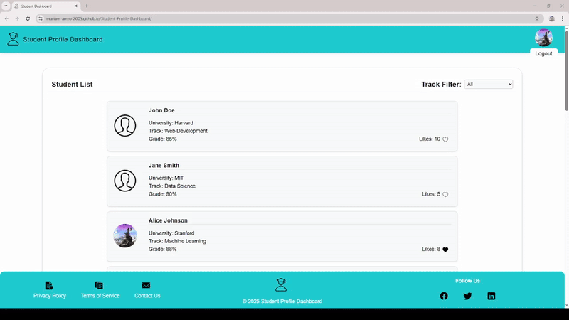

# 🎓 Student Profile Dashboard (React Class Component Based)

This project was created as part of my **Phase 1 Frontend Assignment** with the Minders group.  
It’s my first React project—set up using **Vite**—and focuses on mastering **class components**, **JSX**, **props**, **state**, and **component composition**.

---

## 🌐 Live Demo

[](https://Mariam-Amro-2005.github.io/Student-Profile-Dashboard)

👉 [View the Live Dashboard](https://Mariam-Amro-2005.github.io/Student-Profile-Dashboard/)

---

## 📷 Project Preview

<p align="center">
  
</p>

---

## 🛠️ Overview

The goal of this project was to build a small dashboard that displays a list of students with their personal details and allows user interaction through buttons and state.

It includes reusable components, interactivity (likes), and basic UI filtering using React’s component composition approach.

---

## ✅ Features Implemented

- Built using **5 class components**:
  - `App`
  - `Header`
  - `StudentList`
  - `StudentCard`
  - `Footer`
- Valid **JSX** with at least 3 semantic elements per component
- **Props** passed to each `StudentCard`:
  - `name`, `university`, `track`, `grade`
- Implemented **state and event handling**:
  - Each card has a **Like** button with a working counter
- Used **component composition**:
  - `App` renders `Header`, `StudentList`, and `Footer`
  - `StudentList` maps and renders multiple `StudentCard`s

### 🌟 Bonus Feature
- Dropdown in `App` to **filter students by track** (e.g., Frontend, Backend)

---

## 🚀 Technologies Used

- [React](https://reactjs.org/) – Class Components only
- [Vite](https://vitejs.dev/) – Project setup and dev server
- JSX, Props, State, Events
- Vanilla CSS for styling

---

## 📦 Getting Started Locally

```bash
# Clone the repository
git clone https://github.com/Mariam-Amro-2005/Student-Profile-Dashboard.git

# Navigate to the project folder
cd Student-Profile-Dashboard

# Install dependencies
npm install

# Run the development server
npm run dev
```

Then open your browser at http://localhost:5173/Student-Profile-Dashboard

## 📚 What I Learned
- How to set up a React project using Vite
- Creating a modular UI with class-based components
- Handling props, state, and event listeners
- Building interactive UIs with dynamic state updates
- Using component composition to break down a page logically
